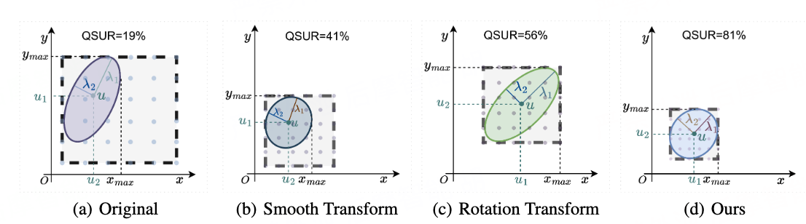
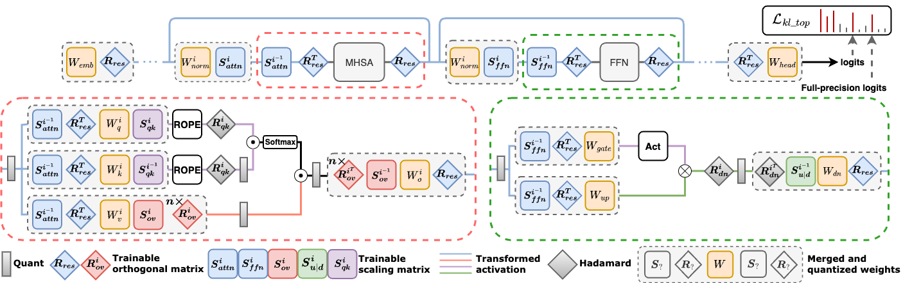
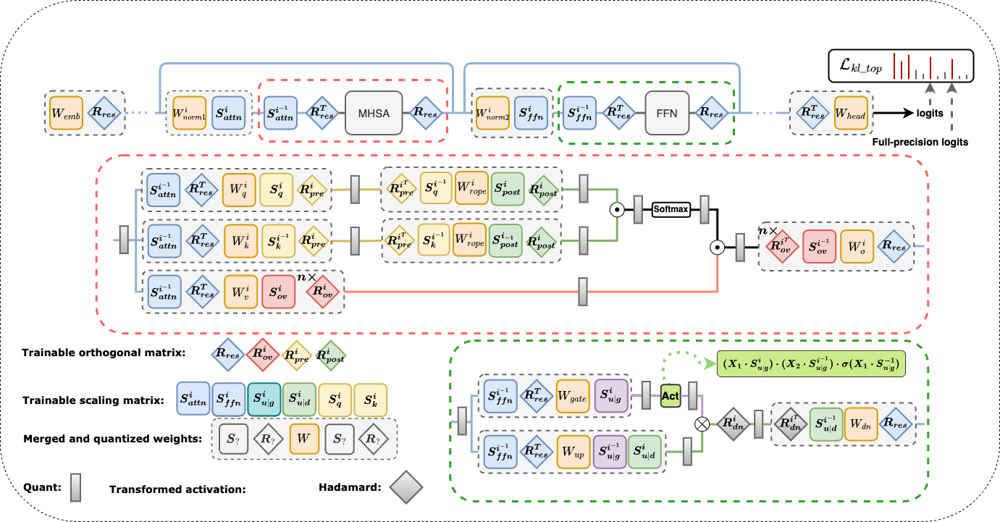

# OSTQuant
Official code for **ICLR2025** paper [OSTQuant: Refining Large Language Model Quantization with Orthogonal and Scaling Transformations for Better Distribution Fitting](https://openreview.net/forum?id=rAcgDBdKnP)

## Motivation

Fig1 : 
Transformation of a batch of data $X \sim \mathcal{N}({\mu}, {\Sigma})$  using different methods. Eigenvalues  $\lambda_1$  and  $\lambda_2$  represent the spread of the distribution along principal axes after eigenvalue decomposition of  $\Sigma$ . (a) shows the original distribution, while (b), (c), and (d) illustrate the effects of the Smooth-based, Rotate-base, and ours OST-based methods, respectively, on QSUR.

## OSTQuant Diagram

Fig2 : The overall flow diagram of OSTQuant. The top section of the figure illustrates how the global orthogonal transformation, $R_{res}$, along with the two scaling transformations, $S_{attn}$ and $S_{ffn}$, collaborate within each block to adjust the distributions across the entire network while maintaining computational invariance. The bottom section highlights four equivalent transformation pairs applied to the FFN and Self-Attention layers. Each fully-connected (FC) layer’s activation and weight are influenced by one or more of these transformation pairs. During runtime, these transformation pairs are fused with the weights, ensuring minimal runtime overhead.

## Evaluate from ours optimized transformation matrix weights
We have provided the optimized transformation matrix weights in [google drive](https://drive.google.com/drive/folders/10kFP3G-qdDvpPik9F9jy49c3yQbGFG6N?usp=sharing).

You can choose to load the checkpoints we provide to evaluate directly.
```sh
python main.py --output_dir output/llama2_w4a16kv16 --model weights/Llama-2-7b-hf  \
 --loss_type=kl_top --post_attn=True \
 --rotate_ov=True --rotate_post_rope=False --online_qk_hadamard=False --smooth_qk=True --smooth_ov=True --smooth_up_down=True --smooth_norm_linear=True --bf16=True --lm_eval=True --per_device_train_batch_size=4 \
 --max_steps=100 --a_bits=16 --v_bits=16 --k_bits=16 --down_bits=16 --w_clip=True\
 --train_enable_wquant=True --sub_mean False --train_rotate=False --resume_path=checkpoints/llama2_7b_w4a16kv16.bin
```

## Reproduce from scratch
You can repdoduce our results with the following command:
```python
export CUDA_VISIBLE_DEVICES="0,1,2,3"
sh scripts/w4a16kv16.sh
```
## Main Results

#### Table：Comparison of perplexity on WikiText2 and averaged accuracy on nine Zero-Shot tasks. Results for SmoothQuant, GPTQ, OmniQuant, AWQ, and QuaRot are based on official code and SpinQuant's results for LLaMA-2/3 using official weights, with LLaMA-1 from the official code.

| #Bits W-A-KV | Method       | LLaMA-3 8B  |          | LLaMA-2 7B  |          | LLaMA-2 13B |          | LLaMA 7B    |          | LLaMA 13B   |          | LLaMA 30B   |          |
|--------------|--------------|-------------|----------|-------------|----------|-------------|----------|-------------|----------|-------------|----------|-------------|----------|
|              |              | 0-shot<sup>9</sup> | Wiki     | 0-shot<sup>9</sup> | Wiki     | 0-shot<sup>9</sup> | Wiki     | 0-shot<sup>9</sup> | Wiki     | 0-shot<sup>9</sup> | Wiki     | 0-shot<sup>9</sup> | Wiki     |
|              |              | Avg.(↑)     | (↓)      | Avg.(↑)     | (↓)      | Avg.(↑)     | (↓)      | Avg.(↑)     | (↓)      | Avg.(↑)     | (↓)      | Avg.(↑)     | (↓)      |
| **16-16-16** | FloatingPoint| 68.09       | 6.14     | 65.21       | 5.47     | 67.61       | 4.88     | 64.48       | 5.68     | 66.67       | 5.09     | 70.00       | 4.10     |
| **4-16-16**  | RTN          | 63.70       | 8.13     | 61.27       | 7.02     | 60.24       | 6.39     | 62.67       | 7.94     | 63.45       | 8.60     | 65.69       | 6.13     |
|              | SmoothQuant  | 62.79       | 8.12     | 58.88       | 8.03     | 62.03       | 5.86     | 62.24       | 7.46     | 62.69       | 18.75    | 65.69       | 5.80     |
|              | GPTQ         | 61.03       | 7.43     | 60.86       | 9.84     | 64.71       | 5.79     | 60.15       | 7.93     | 64.36       | 6.58     | 66.95       | 5.26     |
|              | OmniQuant    | 65.66       | 7.19     | 63.19       | 5.74     | 66.38       | 5.02     | 63.42       | 5.86     | 66.22       | 5.21     | 69.07       | 4.25     |
|              | AWQ          | 67.03       | 7.36     | 63.89       | 5.83     | 66.25       | 5.07     | 63.30       | 5.97     | 65.58       | 5.28     | 69.44       | 4.28     |
|              | QuaRot       | 67.27       | 6.53     | 64.30       | 5.62     | 66.95       | 5.00     | 63.40       | 5.83     | 65.91       | 5.20     | 69.73       | 4.27     |
|              | SpinQuant    | 66.54       | **6.49** | 63.59       | **5.58** | 67.14       | 5.00     | 63.94       | **5.76** | 66.32       | **5.16** | 69.62       | 4.21     |
|              | **OSTQuant** | **67.80**   | 6.53     | **64.37**   | 5.64     | **67.31**   | **4.94** | **64.13**   | 5.81     | **66.62**   | 5.21     | **69.84**   | **4.19** |
| **4-4-16**   | RTN          | 33.42       | 6e2      | 32.44       | nan      | 30.86       | 8e3      | 32.51       | 7e3      | 31.63       | 3e4      | 31.57       | 2e3      |
|              | SmoothQuant  | 33.04       | 1e3      | 32.13       | nan      | 34.26       | 1e3      | 34.42       | 3e2      | 33.29       | 6e2      | 34.64       | 1e3      |
|              | GPTQ         | 32.98       | 5e2      | 32.72       | nan      | 30.11       | 4e3      | 32.12       | 1e3      | 31.51       | 3e3      | 30.88       | 2e3      |
|              | QuaRot       | 61.69       | 8.02     | 61.87       | 6.05     | 65.13       | 5.35     | 61.76       | 6.22     | 64.46       | 5.50     | 68.14       | 4.57     |
|              | SpinQuant    | 64.11       | 7.28     | 57.37       | 6.78     | 63.23       | 5.24     | 61.82       | 6.08     | 64.59       | **5.36** | 68.08       | 4.53     |
|              | **OSTQuant** | **65.14**   | **7.24** | **63.90**   | **5.60** | **66.24**   | **5.14** | **62.72**   | **6.04** | **65.80**   | 5.40     | **68.52**   | **4.43** |
| **4-4-4**    | RTN          | 33.18       | 7e2      | 32.67       | nan      | 30.93       | 7e3      | 32.87       | 1e4      | 31.33       | 3e4      | 31.64       | 2e3      |
|              | SmoothQuant  | 32.96       | 1e3      | 32.12       | nan      | 33.36       | 1e3      | 33.32       | 3e2      | 33.28       | 5e2      | 34.65       | 1e3      |
|              | GPTQ         | 33.71       | 6e2      | 33.52       | nan      | 27.85       | 5e3      | 31.80       | 2e3      | 30.63       | 3e3      | 31.07       | 2e3      |
|              | OmniQuant    | 32.33       | 4e2      | 48.40       | 14.26    | 50.35       | 12.30    | 48.46       | 11.26    | 45.63       | 10.87    | 45.04       | 12.35    |
|              | QuaRot       | 61.38       | 8.18     | 61.48       | 6.11     | 65.16       | 5.39     | 61.22       | 6.26     | 64.59       | 5.53     | 68.08       | 4.60     |
|              | SpinQuant    | 64.10       | 7.35     | 62.01       | 5.96     | 64.13       | 5.74     | 61.32       | 6.12     | 64.95       | **5.39** | 68.14       | 4.55     |
|              | **OSTQuant** | **65.37**   | **7.29** | **63.18**   | **5.91** | **65.41**   | **5.25** | **62.55**   | **6.07** | **65.43**   | 5.40     | **68.20**   | **4.42** |


## Contributing
We welcome contributions from the research and development community! Whether you're interested in improving the existing features, adding new functionalities, or reporting issues, your input is invaluable.

## Future Work
We plan to extend OSTQuant to FullyQuant, aiming to quantize all activations within a Transformer block. The Fig3 below demonstrates our design to improve the QSUR of activations across all layers.

### OSTQuant for FullyQuant.



## Citation
If you find OSTQuant useful in your research, please consider citing our paper:
```bibtex
@inproceedings{hu2025ostquant,
title={{OSTQ}uant: Refining Large Language Model Quantization with Orthogonal and Scaling Transformations for Better Distribution Fitting},
author={Xing Hu, Yuan Cheng, Dawei Yang, Zhixuan Chen, Zukang Xu, Jiangyong Yu, Chen Xu, Zhihang Yuan, Zhe jiang and Sifan Zhou},
booktitle={The Thirteenth International Conference on Learning Representations},
year={2025},
url={https://openreview.net/forum?id=rAcgDBdKnP}
}
```

## Star History
[](https://star-history.com/#BrotherHappy/OSTQuant&Date)